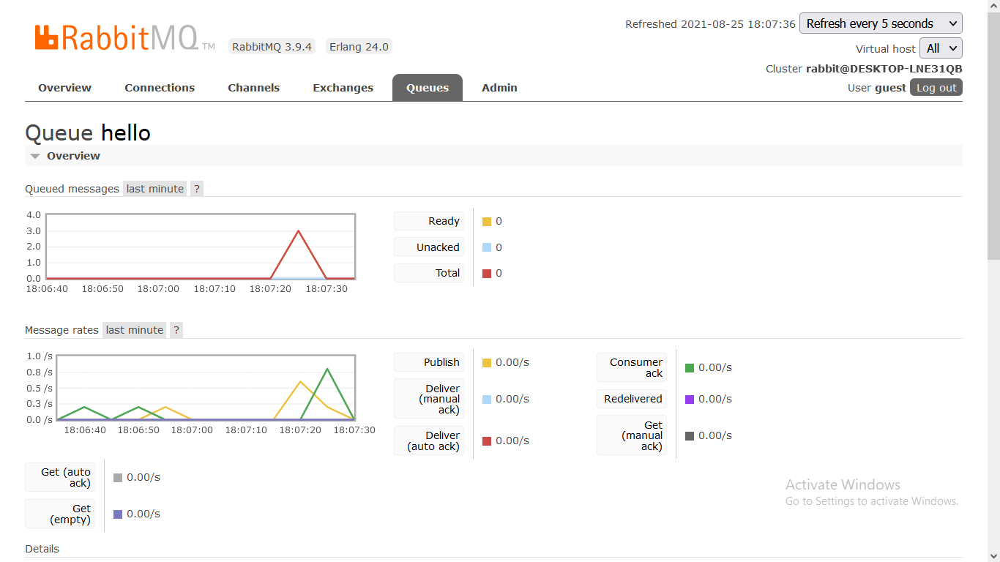

# RabbitMQ_roject
A project using RabbitMQ and Python


## Starting RabbitMQ:
Install rabbit MQ.  
Open this application : **dminstrator RabbitMQ Command Prompt**
<b>

```bash
rabbitmq-plugins enable rabbitmq_management
```

</b>

## Sever Link:


http://127.0.0.1:15672/   

Login  
username: **guest**  
password: **guest**


# How it works:

There is a file called **publisher.py**.  
This file publishes data to the RabbitMQ broker.  

There is another file called **receiver.py**.  
This received the data and consumes it.




In this image, the data gets published and received.
